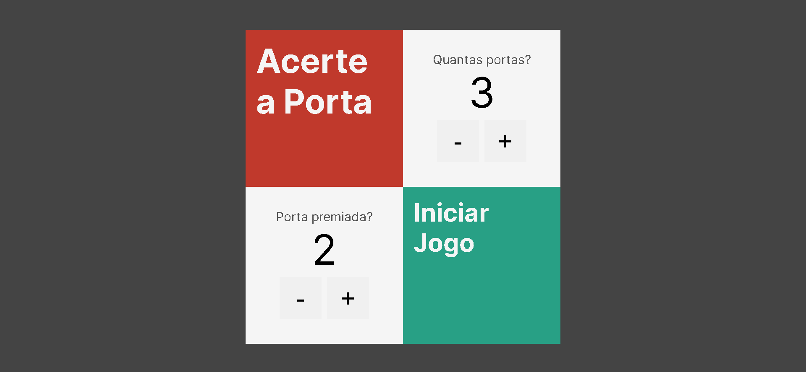
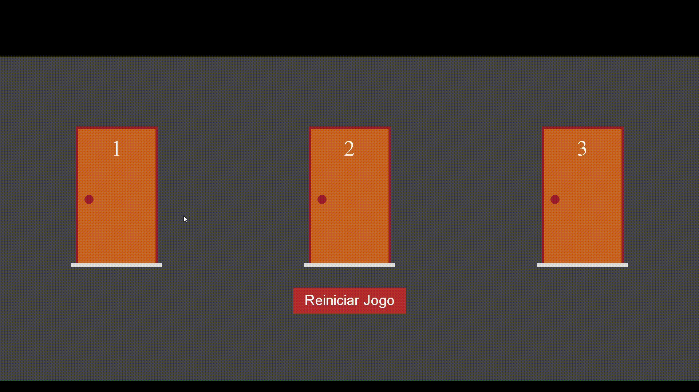

# Jogo de Acertar a Porta Premiada

Este é um projeto de um jogo de acertar a porta premiada. O jogo permite escolha do número de portas (de 1 a 7) e que alguem escolha qual porta terá o presente. O objetivo do jogador é acertar a porta premiada.

- [Link do Projeto](https://moraiskaua-jogo-das-portas.netlify.app)

## Tecnologias Utilizadas

- [Next.js](https://nextjs.org/): Um framework React para desenvolvimento web.
- [TypeScript](https://www.typescriptlang.org/): Uma linguagem de programação que adiciona tipagem estática ao JavaScript.

## Imagens

